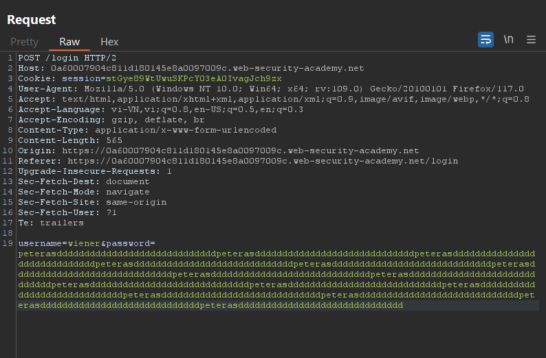
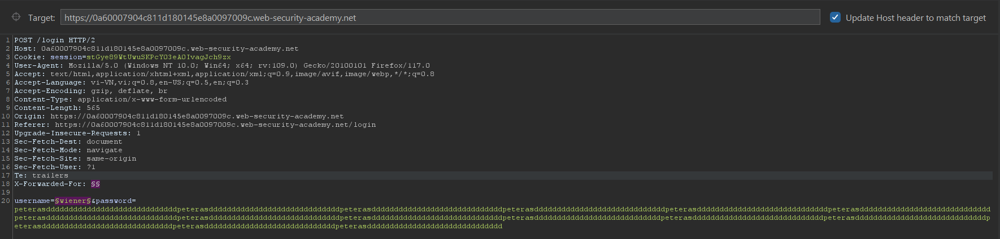
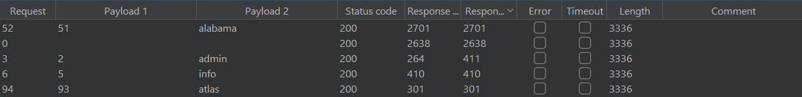
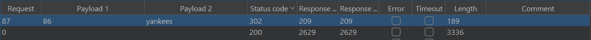

# Authentication lab

## Lab: Username enumeration via different responses

- Ở bài lab 1 này họ cho mình 2 danh sách mật khẩu và tài khoản cần brute-force. Em đã nhập thử tài khoản và mật khẩu sai trước. Hệ thống có thông báo tài khoản không tồn tại. 

- Vậy thì để tiết kiệm thời gian brute-force các cặp tài khoản mật khẩu em sẽ check tài khoản trước.

- Có mỗi một tài khoản `asia` có length khác so với các tài khoản còn lại và có response `Incorrect password`. Sửa tên thành `asia` và brute nốt mật khẩu.

- Mật khẩu có length khác hẳn so với đống còn lại `amanda`.

## Lab: Username enumeration via subtly different responses

- Bài này em cũng thử nhập bừa cả username và password để xem và có nhận được thông báo sai tài khoản hoặc mật khẩu

- Vậy nên em sẽ sử dụng tính năng `cluster bomb` để brute cặp user-pass.

- Sau gần 10000 payload thì em đã tìm được tài khoản là `azureuser` và mật khẩu `mustang`

## Lab: Username enumeration via response timing

- Bài này em vẫn sẽ thử nhập tài khoản và mật khẩu để thử xem response như thế nào

- Em thử đăng nhập đúng và sai thì nhận ra nếu mật khẩu dài thì nó sẽ kiểm tra rất lâu. Tức thời gian phản hồi sẽ phụ thuộc vào độ dài mật khẩu (nếu tài khoản đúng).

- Từ đây em sẽ brute force với mật khẩu dài và tên tài khoản. 

- Bài này họ giới hạn request nên em sử dụng thêm header `X-Forwarded-For` khác nhau với từng request.

- Em tìm được tài khoản `alabama` có time response khác với các tài khoản khác và lâu hơn.

- Giờ chỉ cần brute mật khẩu nữa là xong. Em tìm được mật khẩu với status 302 là `yankees`.

