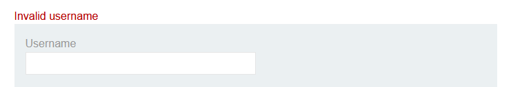
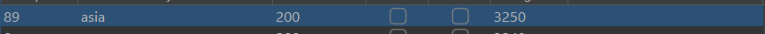
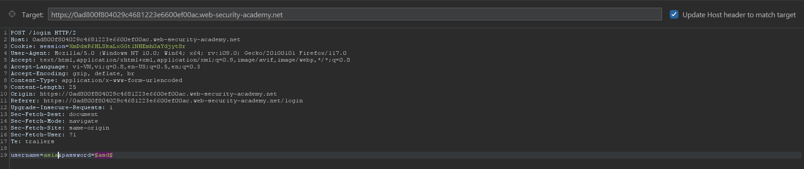
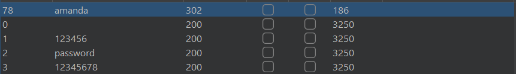
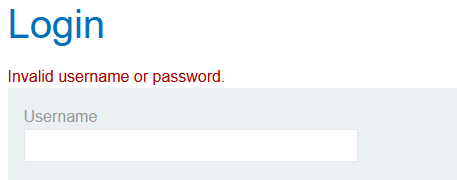
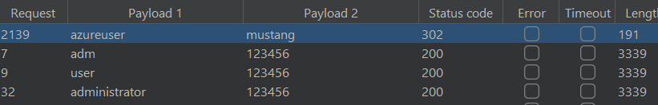
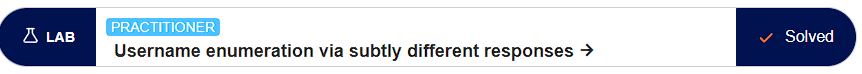

# Authentication lab

## Lab: Username enumeration via different responses

- Ở bài lab 1 này họ cho mình 2 danh sách mật khẩu và tài khoản cần brute-force. Em đã nhập thử tài khoản và mật khẩu sai trước. Hệ thống có thông báo tài khoản không tồn tại. 

- Vậy thì để tiết kiệm thời gian brute-force các cặp tài khoản mật khẩu em sẽ check tài khoản trước.

- Có mỗi một tài khoản `asia` có length khác so với các tài khoản còn lại và có response `Incorrect password`. Sửa tên thành `asia` và brute nốt mật khẩu.

- Mật khẩu có length khác hẳn so với đống còn lại `amanda`.

## Lab: Username enumeration via subtly different responses

- Bài này em cũng thử nhập bừa cả username và password để xem và có nhận được thông báo sai tài khoản hoặc mật khẩu

- Vậy nên em sẽ sử dụng tính năng `cluster bomb` để brute cặp user-pass.

- Sau gần 10000 payload thì em đã tìm được tài khoản là `azureuser` và mật khẩu `mustang`

