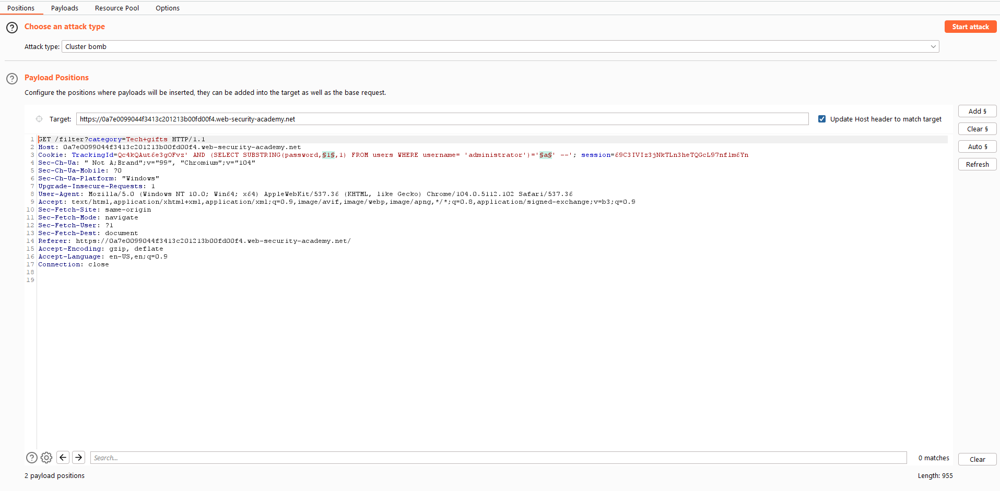
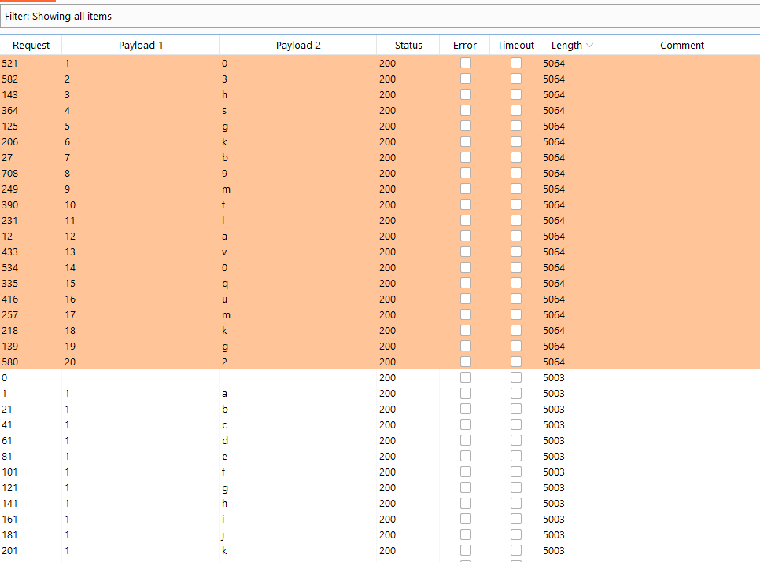
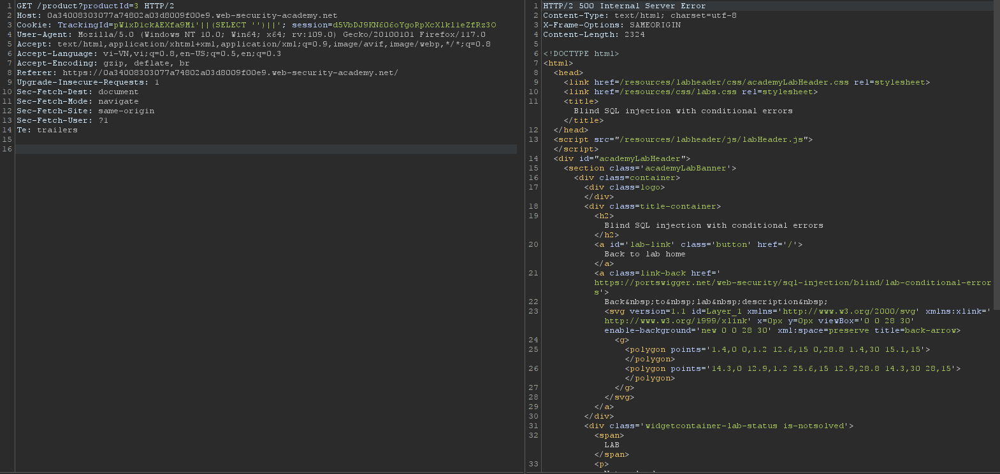
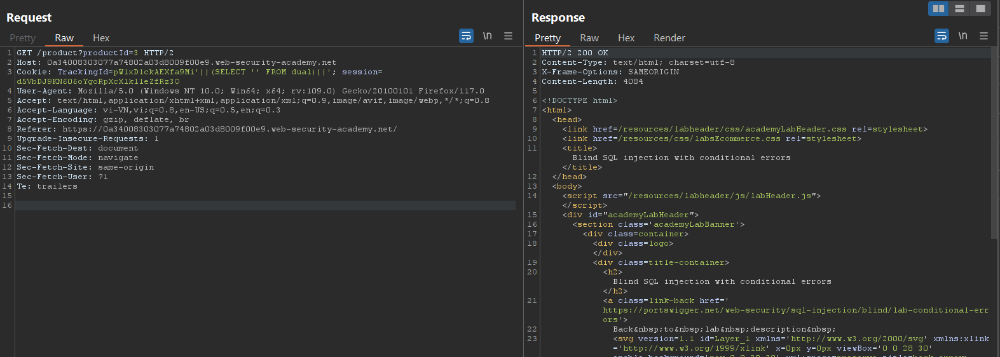
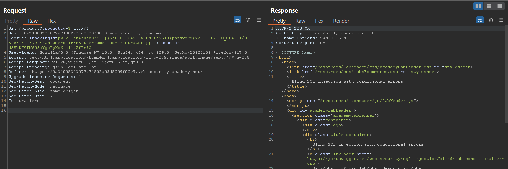
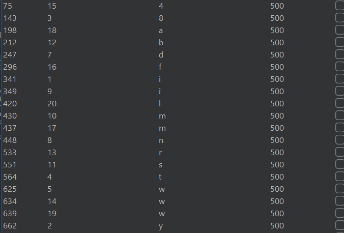
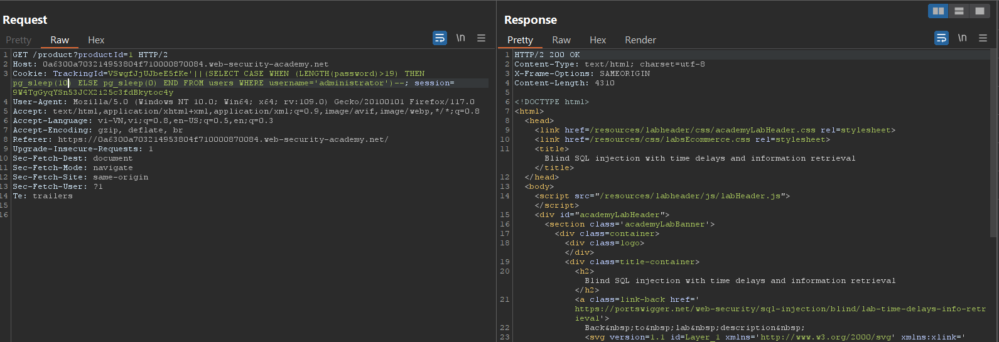
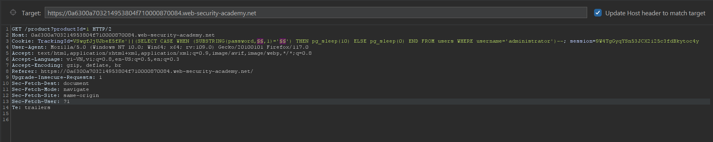
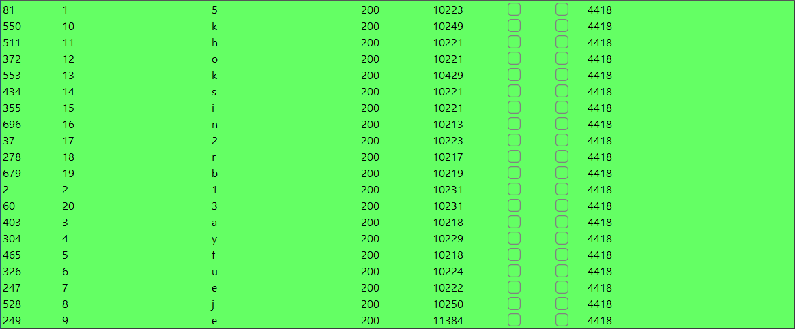

# Blind_SQL_injection

- `Blind SQL injection` là một phần của SQL injection, tuy nhiên các phản hồi HTTP của nó không chứa kết quả của truy vấn SQL hoặc không hiển thị bất cứ lỗi nào của cơ sở dữ liệu.

## Khai thác Blind SQL injection bằng phương pháp kích hoạt các phản hồi có điều kiện

- Thông thường đối với một trang web sẽ sử dụng `Cookie` để quản lý người dùng. Nếu một Cookie của một người sử dụng cũ sẽ được trang web trả về kết quả `Welcome back`.
- Ta có thể dựa vào điều này để tấn công `Blind SQL`.
- Đầu tiên Mình thử kiểm tra xem trang web có trả về kết quả nếu truy vấn sai hay không.

```sql
' AND 1=1 -- 
' AND 1=2 --
```

- Với truy vấn đầu tiên ta thấy nó đã trả về kết quả `Welcome back` suy ra ta có thể khai thác được. Query có dạng:

```sql
SELECT TrackingId FROM TrackedUsers WHERE TrackingId = 'u5YD3PapBcR4lN3e7Tj4'
```

- Mình sẽ sử dụng hàm `SUBSTRING` để kiểm tra từng kí tự ở từng vị trí xem nó có đúng không, nếu kí tự đó thỏa mãn thì nó sẽ trả về kết quả là `Welcome back`.

```sql
xyz' AND SUBSTRING((SELECT Password FROM Users WHERE Username = 'Administrator'), 1, 1) > 'm
```

- Ở đây sau khi tìm được độ dài của flag bằng 20 mình đã brute force các request tạo ra length đúng của từng vị trí password rồi ghép lại.



- Mình sẽ sử dụng 2 paypoad ứng với 2 vị trí, kiểu brute force là Cluster Bomb.



## SQL injection Error-Based

Cũng giống như cách tấn công phản hồi có điều kiện, tuy nhiên ở đây trang web có thể không trả về những thông tin dạng boolean hoặc check cookie để ta nhận biết truy vấn có đúng hay không. Vậy nên ta cần dựa vào lỗi được trả về của trang web như status code 500 để biết truy vấn có thể tấn công hay chưa.

- Mình sẽ sử dụng 1 ví dụ về lỗi `divided-by-zero` error như sau:

```sql
Cookie: <random-string>;

xyz' AND (SELECT CASE WHEN (1=2) THEN 1/0 ELSE 'a' END)='a
xyz' AND (SELECT CASE WHEN (1=1) THEN 1/0 ELSE 'a' END)='a
```

- Với trường hợp thứ nhất điều kiện sai cho nên không có lỗi xảy ra, tuy nhiên trường hợp 2 có lỗi `divided-by-zero` do điều kiện đúng chạy vào nhánh THEN. Từ lỗi này ta có thể dựa vào đó để khai thác thêm.

Mình sẽ nói rõ hơn với LAB của port-swigger:

- Đầu tiên mình nhận thấy có thể inject SQL vào phần TrackingId. Mình đã thử kiểm tra 1 phép boolean ở đây:

```sql
TrackingId=xyz'
TrackingId=xyz''
```

Nhận thấy có lỗi Syntax Error mình có thể sử dụng được

- Giờ cần tìm được phiên bản SQL nào được sử dụng trong server để có thể có query chính xác nhất. Mình sẽ check `Oracle` và `PostgreSQL` trước vì nó có cách nối chuỗi khác.



- Mình kiểm tra phiên bản của Oracle và truy vấn đến tables `dual` riêng của nó và đã có kết quả: 



- Tiếp theo mình sẽ sử dụng truy vấn để kiểm tra số kí tự có trong password, vẫn sẽ là sử dụng lỗi `divided-by-zero`:



- Mình đã xác định được password có 20 kí tự. giờ chỉ cần brute force với `intruder` của burp suite với 2 vị trí như sau:

```
Cookie: TrackingId=pW1xD1ckAEXfa9Mi'||(SELECT CASE WHEN (SUBSTR(password,§§,1)='§§') THEN TO_CHAR(1/0) ELSE '' END FROM users WHERE username='administrator')||';
```

- Cuối cùng mình sẽ lấy tất cả các payload có status code = 500 để lấy mật khẩu của admin và login được:



## Triggering time delays

Khi những request của mình được gửi lên cùng server mà không có phản hổi như lỗi hay kết quả của cột được trả về. Thời gian trả về đồng thời thì mình có thể tính đến trường hợp sử dụng time delay để tấn công.

LAB 1:
- Ở đây chỉ đơn giản là mình cần inject 1 đoạn query làm sao có thể có cả time delay 10s. Vì ở trong cheatsheet có rất nhiều loại time delay ứng với nhiều phiên bản nên mình cần check version.
- Mình check được server sử dụng DB Postgre và đã inject được:
```sql
TrackingID:xyz'||pg.sleep(10)--
```

LAB 2:
Ở lab 2 này có khác so với 1 là mình cần phải lấy được cả mật khẩu của admin để tiến hành login.

- Bước đầu tiên vẫn như thông thường để sử dụng `SUBSTRING` mình cần xác định phiên bản SQL đang được sử dụng:
```sql
TrackingId=VSwgfJjUJbeE5fKe'||(pg_sleep(10))--
```

- Sau khi tìm được phiên bản SQL đang sử dụng là Postgre mình xác định được cú pháp truy vấn của `SUBSTRING`. TRước khi sử dụng `SUBSTRING` mình sẽ xác định số kí tự của mật khẩu.



- Giờ mình sẽ sử dụng `Intruder` để kiểm tra và lấy được mật khẩu của `admin`:





- Lấy mật khẩu theo tăng dần payload 1 là done.


