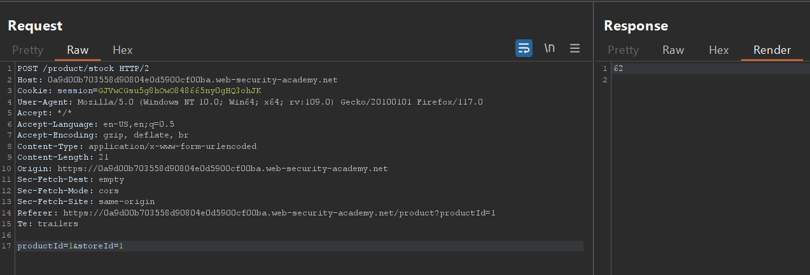
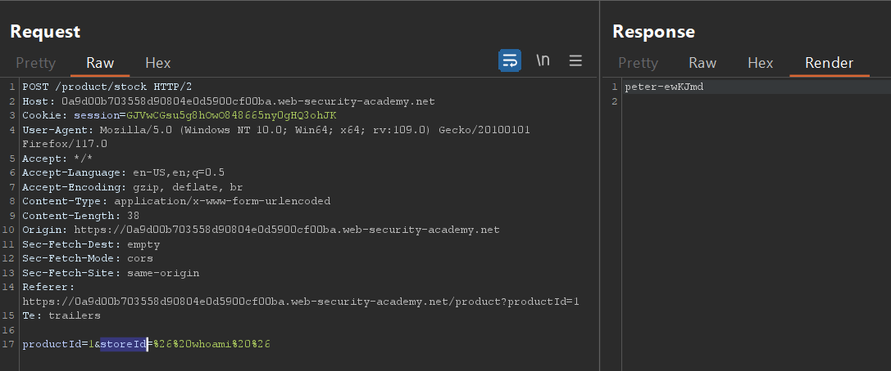
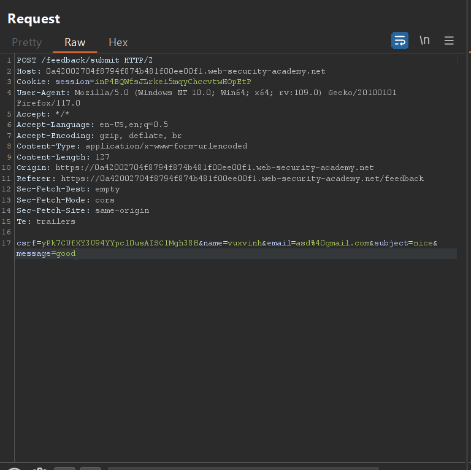
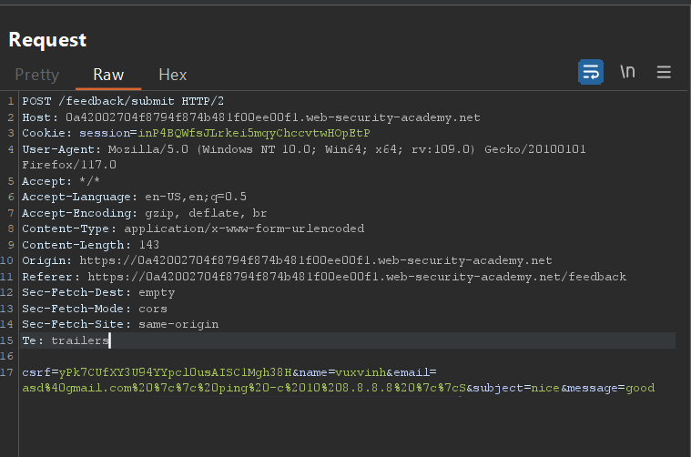
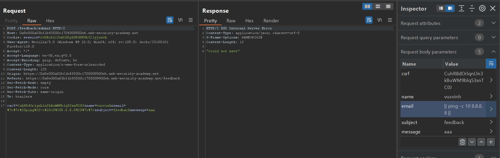
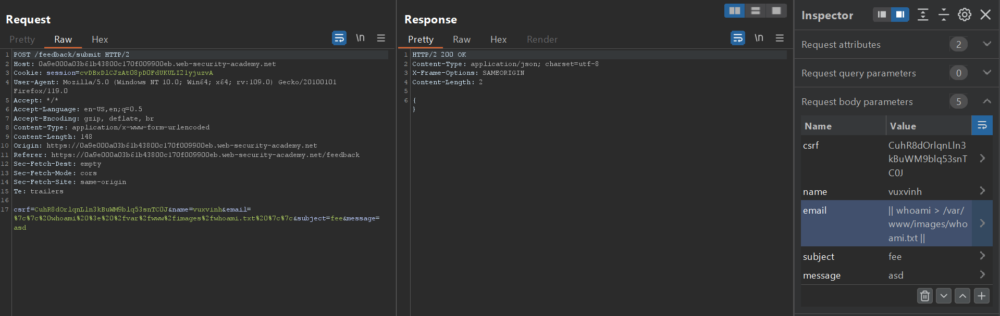
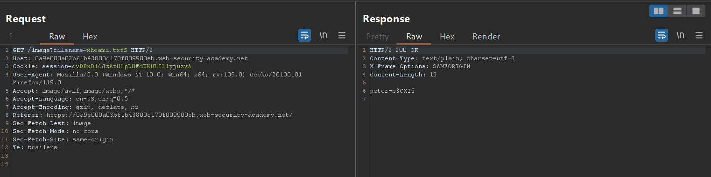

# OS Command injection

## Lab: OS command injection, simple case

- Bài lab này mục tiêu của chúng ta là sẽ tấn công command injection vào phần `check stock` của trang web. Khi em thử tính năng `check stock` và bắt lại 1 req với burp em có được



- Với phần `productId` và `StoreId` em nghĩ có thể sửa để chèn thêm command vào. Ở đây em đã thử sửa `StoreId` thành 

```
& whoami & => %26%20whoami%20%26
```

- Để nó được trở thành value của param thì em sẽ phải sử dụng URL encoding cũng để phù hợp với trang web hơn.



## Lab: Blind OS command injection with time delays

- Bài này đã `blind command injection` tức là mọi kết quả dù là với query ban đầu đều không thể hiển thị kết quả lên màn hình. Từ đây em nghĩ phải sử dụng `time delay` để phát hiện xem code đã được thực thi hay chưa.

-Với một feedback cơ bản thì nó sẽ có param như bên dưới.



- Em sẽ chèn thêm command vào phần email tuy nhiên ở đây không sử dụng cú pháp `&` mà là cú pháp `||` 

> || ở đây sẽ thực hiện command ở đằng sau khi mà command đằng trước bị lỗi không thực hiện được

- Khi em sửa req với param của giá trị `email` thành 

```
ping -c 10 8.8.8.8 => %7c%7c%20ping%20-c%2010%208.8.8.8%20%7c%7c
```

- Thì sẽ execute được 10 lần ping rồi mới trả về kết quả nên nó sẽ lâu hơn



## Exploiting blind OS command injection by redirecting output

- Dạng bài này cũng giống như dạng blind trên vì khi ta nhập kết quả trang web chỉ trả về giá trị `successfully` chứ không hiển thị thêm bất cứ giá trị nào.


- Đầu tiên em vẫn sẽ tìm giá trị có thể  inject command vào.
Em sẽ sử dụng lệnh:

```
|| ping -c 10 8.8.8.8 || => %7c%7c%20ping%20-c%2010%208.8.8.8%20%7c%7c
```

- Hai giá trị `||` chỉ thực hiện khi command đằng trước chắc chắn sai thì command đằng sau sẽ thực hiện



- Em đã tìm được tại biến `email` có thể thực hiện `command injection`.



- Sau đó em sử dụng chức năng tìm ảnh `filename?image=whoami.txt` để đọc nội dung file.




